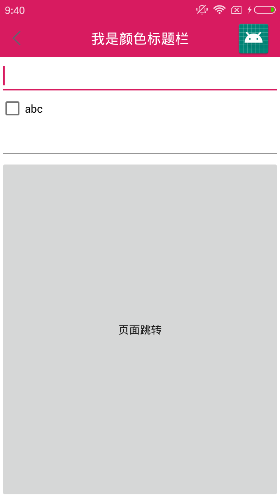

# DefTitleBar
快速构建整个项目通用的标题栏，而且不会对键盘做成任何的影响。
1. 默认提供三种标题样式加载方法：白色标题、颜色标题、资源渐变标题。
2. 白色标题：标题栏白底，6.0+ 状态栏白底黑字，6.0以下黑底白字。
3. 颜色标题：标题栏为用户设置颜色，4.4+ 状态栏白字用户设置的颜色，4.4以下状态栏黑底白字。
4. 颜色标题：标题栏为用户设置资源色，4.4+ 状态栏白字用户设置的资源色，4.4以下状态栏黑底白字。
### 引入

```
allprojects {
		repositories {
			...
			maven { url 'https://jitpack.io' }
		}
	}


implementation 'com.github.wenkency:titlebar:2.0.0'

```

### 使用方式
```
    <!-- Base application theme. -->
    <style name="AppTheme" parent="Theme.AppCompat.Light.NoActionBar">
        <!-- Customize your theme here. -->
        ...
    </style>

        DefTitleBar titleBar = new DefTitleBuilder(this)
                // 返回按钮
                .setLeftRes(R.drawable.ic_title_back)
                .build();
        int color = getResources().getColor(R.color.colorPrimaryDark);
        // 标题的颜色、背景颜色、6.0+状态栏字体是不是黑色
        titleBar.colorStyle(color, Color.WHITE, false);
        // 标题文字
        titleBar.setTitle("我是主页面");
        // 标题颜色
        titleBar.setTitleColor(Color.WHITE);

        // 右边图片及点击事件
        titleBar.setRightIcon(R.mipmap.ic_launcher, new View.OnClickListener() {
            @Override
            public void onClick(View v) {
                Toast.makeText(MainActivity.this, "右边点击", Toast.LENGTH_SHORT).show();
            }
        });
        // titleBar.whiteStyle();

```

### 运行结果





